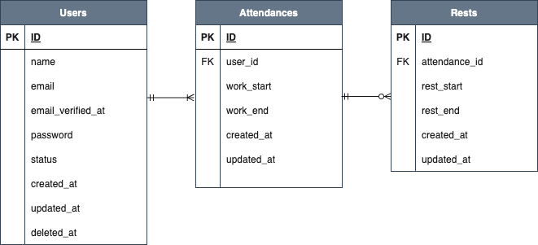

# Atte
打刻によりユーザーの勤怠を管理できるシステムです。

TOPページ


各ボタンをクリックすると、打刻ボタンが切り替わります。
<br>
例：勤務開始ボタンクリック時


例：勤務終了ボタンクリック時

<br>

## 作成した目的
学習のアウトプットのため
<br>
企業の勤怠管理システムを作成
<br>
<br>

## 機能一覧
  * 認証機能
    * 会員登録
    * ログイン
    * メール認証
    * ログアウト

   
  * 打刻機能
    * ボタンを押した時点の時刻を保存
    * 重複してボタンを押さないよう、勤怠ボタンを切り替える。
    * 日をまたいだ時点で翌日の出勤操作に切り替える
      
  * 日付毎の勤務データ閲覧
    * その日に勤務したユーザーと勤務時間を表示(勤務開始、勤務終了、休憩時間合計、勤務時間) 
    * 検索ボタンにより前日、翌日のデータを検索できる

  * ユーザー一覧データ閲覧
    * 現時点の登録ユーザー情報一覧(名前や登録年月日、勤務状態を表示)
    * 検索機能
    * ユーザー情報の更新、削除機能

  * ユーザー毎の勤怠表閲覧
    * ユーザーの勤怠表を月毎に表示(勤務開始、勤務終了、休憩時間合計、勤務時間)
    * 検索ボタンにより前月、翌月のデータを検索できる
    * ユーザー検索機能
<br>
<br>
   
## 使用技術
Laravel Framework 8.83.8
<br>
php 8.3.8
<br>
mysql 8.0.26
<br>
<br>

## テーブル設計

<br>
<br>

## ER図

<br>
<br>

## 環境構築

#### Docker ビルド

```
git clone githubのリンク
```

```
docker-compose up -d --build
```

> _Mac の M1・M2 チップの PC の場合、`no matching manifest for linux/arm64/v8 in the manifest list entries`のメッセージが表示されビルドができないことがあります。
> エラーが発生する場合は、docker-compose.yml ファイルの「mysql」内に「platform」の項目を追加で記載してください_

```bash
mysql:
    platform: linux/x86_64(この文追加)
    image: mysql:8.0.26
    environment:
```

<br>
<br>

#### Laravel環境構築
  1. PHPコンテナへ入る
  ```
  docker-compose exec php bash
  ```
  <br>

  2. composer をインストール
  
  ```
  composer install
  ```

  <br>
  
  3. .env.example ファイルをコピーして.env ファイルを作成し、環境変数を変更する(docker-compose.ymlを参照)
  
  ```
  cp .env.example .env
  ```

  <br>
  
  ```
  DB_CONNECTION=mysql
  DB_HOST=mysql(変更)
  DB_PORT=3306
  DB_DATABASE=laravel_db(変更)
  DB_USERNAME=laravel_user(変更)
  DB_PASSWORD=laravel_pass(変更)
  ```
  <br>

  4. アプリケーションキーを取得
  
  ```
  php artisan key:generate
  ```
  
  <br>
  
  5. テーブル作成
  
  ```
  php artisan migrate
  ```

  <br>
  
  6. ダミーデータ作成
  
  ```
  php artisan db:seed
  ```
  
  <br>
  <br>

## URL

- 開発環境
  - ログインページ <http://localhost/login>
- MailHog <http://localhost:8025>
- phpMyAdmin <http://localhost:8080>
